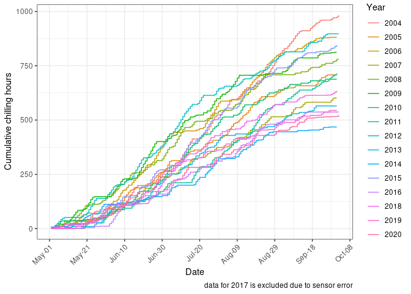
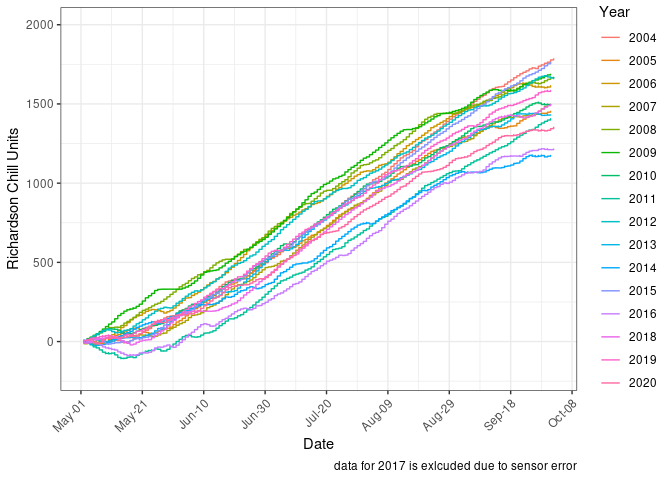
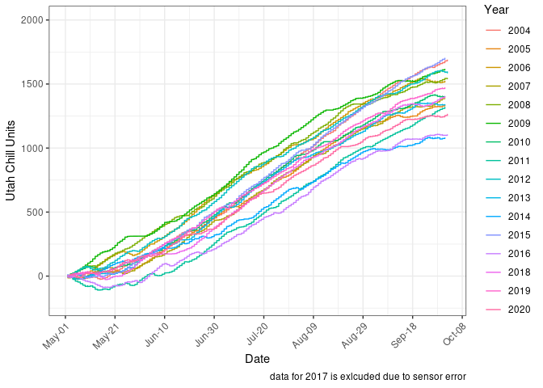
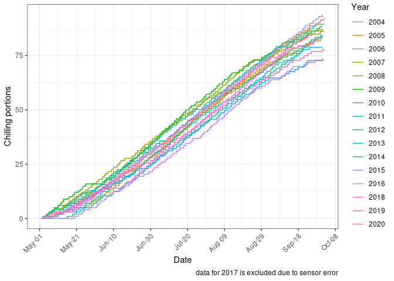

Chill unit models
================

### Background

There are multiple ways of calculating chilling units for fruit and nut
crops, each posing a ‘better’ way of quantifying the amount of chill
accumulating during the winter season prior to budbreak. Historic,
baseline model is the simple “Chill Units” calculation which gives a
chill unit of 1 for every hour at or below 7 degrees C. Other models
have gone into more depth, dividing up the temperature ranges and giving
them weightings of effectiveness such as the
<a href="http://fruitsandnuts.ucdavis.edu/Weather_Services/chilling_accumulation_models/about_chilling_units/">Utah</a>
and <a href="http://harvest.com/support/calculations/">Richardson</a>,
and variations on these.

None of these models is a perfect predictor, the baseline ‘below 7C’
will give an indication if it is a warm or cool year, the Utah and
Richardson models have a bit more finesse in relation to the effect on a
plant’s physiological state but do not deal well wih warmer coastal
climates, nor with periodic warm and then cold spells.

The final model is the
<a href="https://ucanr.edu/sites/fruittree/How-to_Guides/Dynamic_Model_-_Chill_Accumulation/">Dynamic
Model</a>. This uses a function over a period of time at a temperature
threshold to accumulate chilling portions.

### Ramblings

The chill is thought to break down starch into simple sugars which in
turn creates osmodic pressure to drive the start of budbreak.

### Niwa Data

Expected number of hours between May 1st and Septmeber 30th;

    ## [1] 3672

Check how many data points are available for each station by year

<table>

<thead>

<tr>

<th style="text-align:left;">

StationID

</th>

<th style="text-align:right;">

2004

</th>

<th style="text-align:right;">

2005

</th>

<th style="text-align:right;">

2006

</th>

<th style="text-align:right;">

2007

</th>

<th style="text-align:right;">

2008

</th>

<th style="text-align:right;">

2009

</th>

<th style="text-align:right;">

2010

</th>

<th style="text-align:right;">

2011

</th>

<th style="text-align:right;">

2012

</th>

<th style="text-align:right;">

2013

</th>

<th style="text-align:right;">

2014

</th>

<th style="text-align:right;">

2015

</th>

<th style="text-align:right;">

2016

</th>

<th style="text-align:right;">

2017

</th>

<th style="text-align:right;">

2018

</th>

<th style="text-align:right;">

2019

</th>

<th style="text-align:right;">

2020

</th>

</tr>

</thead>

<tbody>

<tr>

<td style="text-align:left;">

KER

</td>

<td style="text-align:right;">

3672

</td>

<td style="text-align:right;">

3672

</td>

<td style="text-align:right;">

3672

</td>

<td style="text-align:right;">

3671

</td>

<td style="text-align:right;">

3671

</td>

<td style="text-align:right;">

3671

</td>

<td style="text-align:right;">

3671

</td>

<td style="text-align:right;">

3671

</td>

<td style="text-align:right;">

3671

</td>

<td style="text-align:right;">

3671

</td>

<td style="text-align:right;">

3671

</td>

<td style="text-align:right;">

3671

</td>

<td style="text-align:right;">

3671

</td>

<td style="text-align:right;">

3671

</td>

<td style="text-align:right;">

3671

</td>

<td style="text-align:right;">

3671

</td>

<td style="text-align:right;">

3647

</td>

</tr>

<tr>

<td style="text-align:left;">

MRL

</td>

<td style="text-align:right;">

3672

</td>

<td style="text-align:right;">

3672

</td>

<td style="text-align:right;">

3672

</td>

<td style="text-align:right;">

3671

</td>

<td style="text-align:right;">

3671

</td>

<td style="text-align:right;">

3671

</td>

<td style="text-align:right;">

3671

</td>

<td style="text-align:right;">

3671

</td>

<td style="text-align:right;">

3671

</td>

<td style="text-align:right;">

3671

</td>

<td style="text-align:right;">

3671

</td>

<td style="text-align:right;">

3671

</td>

<td style="text-align:right;">

3671

</td>

<td style="text-align:right;">

3671

</td>

<td style="text-align:right;">

3671

</td>

<td style="text-align:right;">

3671

</td>

<td style="text-align:right;">

3647

</td>

</tr>

<tr>

<td style="text-align:left;">

PKE

</td>

<td style="text-align:right;">

3672

</td>

<td style="text-align:right;">

3672

</td>

<td style="text-align:right;">

3672

</td>

<td style="text-align:right;">

3671

</td>

<td style="text-align:right;">

3671

</td>

<td style="text-align:right;">

3671

</td>

<td style="text-align:right;">

3671

</td>

<td style="text-align:right;">

3671

</td>

<td style="text-align:right;">

3671

</td>

<td style="text-align:right;">

3671

</td>

<td style="text-align:right;">

3671

</td>

<td style="text-align:right;">

3671

</td>

<td style="text-align:right;">

3671

</td>

<td style="text-align:right;">

3671

</td>

<td style="text-align:right;">

3671

</td>

<td style="text-align:right;">

3671

</td>

<td style="text-align:right;">

3647

</td>

</tr>

<tr>

<td style="text-align:left;">

RIR

</td>

<td style="text-align:right;">

3672

</td>

<td style="text-align:right;">

3672

</td>

<td style="text-align:right;">

3672

</td>

<td style="text-align:right;">

3671

</td>

<td style="text-align:right;">

3671

</td>

<td style="text-align:right;">

3671

</td>

<td style="text-align:right;">

3671

</td>

<td style="text-align:right;">

3671

</td>

<td style="text-align:right;">

3671

</td>

<td style="text-align:right;">

3671

</td>

<td style="text-align:right;">

3671

</td>

<td style="text-align:right;">

3671

</td>

<td style="text-align:right;">

3671

</td>

<td style="text-align:right;">

3671

</td>

<td style="text-align:right;">

3671

</td>

<td style="text-align:right;">

3671

</td>

<td style="text-align:right;">

3647

</td>

</tr>

<tr>

<td style="text-align:left;">

TPK

</td>

<td style="text-align:right;">

3672

</td>

<td style="text-align:right;">

3672

</td>

<td style="text-align:right;">

3672

</td>

<td style="text-align:right;">

3671

</td>

<td style="text-align:right;">

3671

</td>

<td style="text-align:right;">

3671

</td>

<td style="text-align:right;">

3671

</td>

<td style="text-align:right;">

3671

</td>

<td style="text-align:right;">

3671

</td>

<td style="text-align:right;">

3671

</td>

<td style="text-align:right;">

3671

</td>

<td style="text-align:right;">

3671

</td>

<td style="text-align:right;">

3671

</td>

<td style="text-align:right;">

3671

</td>

<td style="text-align:right;">

3671

</td>

<td style="text-align:right;">

3671

</td>

<td style="text-align:right;">

3647

</td>

</tr>

</tbody>

</table>

Now what about NA’s?

<table>

<thead>

<tr>

<th style="text-align:left;">

StationID

</th>

<th style="text-align:right;">

2004

</th>

<th style="text-align:right;">

2005

</th>

<th style="text-align:right;">

2006

</th>

<th style="text-align:right;">

2007

</th>

<th style="text-align:right;">

2008

</th>

<th style="text-align:right;">

2009

</th>

<th style="text-align:right;">

2010

</th>

<th style="text-align:right;">

2012

</th>

<th style="text-align:right;">

2013

</th>

<th style="text-align:right;">

2014

</th>

<th style="text-align:right;">

2016

</th>

<th style="text-align:right;">

2017

</th>

<th style="text-align:right;">

2020

</th>

<th style="text-align:right;">

2011

</th>

<th style="text-align:right;">

2015

</th>

<th style="text-align:right;">

2018

</th>

<th style="text-align:right;">

2019

</th>

</tr>

</thead>

<tbody>

<tr>

<td style="text-align:left;">

KER

</td>

<td style="text-align:right;">

24

</td>

<td style="text-align:right;">

5

</td>

<td style="text-align:right;">

27

</td>

<td style="text-align:right;">

5

</td>

<td style="text-align:right;">

5

</td>

<td style="text-align:right;">

68

</td>

<td style="text-align:right;">

2

</td>

<td style="text-align:right;">

158

</td>

<td style="text-align:right;">

186

</td>

<td style="text-align:right;">

60

</td>

<td style="text-align:right;">

99

</td>

<td style="text-align:right;">

50

</td>

<td style="text-align:right;">

4

</td>

<td style="text-align:right;">

0

</td>

<td style="text-align:right;">

0

</td>

<td style="text-align:right;">

0

</td>

<td style="text-align:right;">

0

</td>

</tr>

<tr>

<td style="text-align:left;">

MRL

</td>

<td style="text-align:right;">

24

</td>

<td style="text-align:right;">

0

</td>

<td style="text-align:right;">

0

</td>

<td style="text-align:right;">

0

</td>

<td style="text-align:right;">

1

</td>

<td style="text-align:right;">

4

</td>

<td style="text-align:right;">

0

</td>

<td style="text-align:right;">

0

</td>

<td style="text-align:right;">

0

</td>

<td style="text-align:right;">

0

</td>

<td style="text-align:right;">

4

</td>

<td style="text-align:right;">

0

</td>

<td style="text-align:right;">

0

</td>

<td style="text-align:right;">

0

</td>

<td style="text-align:right;">

0

</td>

<td style="text-align:right;">

0

</td>

<td style="text-align:right;">

0

</td>

</tr>

<tr>

<td style="text-align:left;">

PKE

</td>

<td style="text-align:right;">

23

</td>

<td style="text-align:right;">

19

</td>

<td style="text-align:right;">

0

</td>

<td style="text-align:right;">

0

</td>

<td style="text-align:right;">

133

</td>

<td style="text-align:right;">

3585

</td>

<td style="text-align:right;">

2

</td>

<td style="text-align:right;">

2262

</td>

<td style="text-align:right;">

0

</td>

<td style="text-align:right;">

0

</td>

<td style="text-align:right;">

150

</td>

<td style="text-align:right;">

0

</td>

<td style="text-align:right;">

1

</td>

<td style="text-align:right;">

10

</td>

<td style="text-align:right;">

80

</td>

<td style="text-align:right;">

1

</td>

<td style="text-align:right;">

1

</td>

</tr>

<tr>

<td style="text-align:left;">

RIR

</td>

<td style="text-align:right;">

23

</td>

<td style="text-align:right;">

0

</td>

<td style="text-align:right;">

0

</td>

<td style="text-align:right;">

0

</td>

<td style="text-align:right;">

0

</td>

<td style="text-align:right;">

0

</td>

<td style="text-align:right;">

0

</td>

<td style="text-align:right;">

8

</td>

<td style="text-align:right;">

0

</td>

<td style="text-align:right;">

0

</td>

<td style="text-align:right;">

1

</td>

<td style="text-align:right;">

0

</td>

<td style="text-align:right;">

55

</td>

<td style="text-align:right;">

0

</td>

<td style="text-align:right;">

0

</td>

<td style="text-align:right;">

0

</td>

<td style="text-align:right;">

0

</td>

</tr>

<tr>

<td style="text-align:left;">

TPK

</td>

<td style="text-align:right;">

37

</td>

<td style="text-align:right;">

0

</td>

<td style="text-align:right;">

0

</td>

<td style="text-align:right;">

0

</td>

<td style="text-align:right;">

156

</td>

<td style="text-align:right;">

176

</td>

<td style="text-align:right;">

0

</td>

<td style="text-align:right;">

0

</td>

<td style="text-align:right;">

1

</td>

<td style="text-align:right;">

0

</td>

<td style="text-align:right;">

1

</td>

<td style="text-align:right;">

0

</td>

<td style="text-align:right;">

3

</td>

<td style="text-align:right;">

0

</td>

<td style="text-align:right;">

0

</td>

<td style="text-align:right;">

155

</td>

<td style="text-align:right;">

10

</td>

</tr>

</tbody>

</table>

Any station with more than a weeks missing data should be excluded. Need
to remove NAs first

<table>

<thead>

<tr>

<th style="text-align:left;">

StationID

</th>

<th style="text-align:right;">

year

</th>

<th style="text-align:right;">

missing\_data\_points

</th>

</tr>

</thead>

<tbody>

<tr>

<td style="text-align:left;">

KER

</td>

<td style="text-align:right;">

2013

</td>

<td style="text-align:right;">

186

</td>

</tr>

<tr>

<td style="text-align:left;">

PKE

</td>

<td style="text-align:right;">

2009

</td>

<td style="text-align:right;">

3585

</td>

</tr>

<tr>

<td style="text-align:left;">

PKE

</td>

<td style="text-align:right;">

2012

</td>

<td style="text-align:right;">

2262

</td>

</tr>

<tr>

<td style="text-align:left;">

TPK

</td>

<td style="text-align:right;">

2009

</td>

<td style="text-align:right;">

176

</td>

</tr>

</tbody>

</table>

### Hours below 7°C

An example of this model on Te Puke yearly data, 1st May to 1st
September.

<!-- -->

## Richardson Chill Units

Example of a Richardson chill graph for Te
Puke.

<!-- -->

### Utah model

Example graph for the base Utah model using Te Puke
data.

<!-- -->

### Dynamic model

Example of the Israel Dynamic model using Te Puke
data

<!-- -->

### Model comparison

Tabulated chilling units per year, per site for each method

<table>

<thead>

<tr>

<th style="text-align:left;">

StationID

</th>

<th style="text-align:right;">

year

</th>

<th style="text-align:right;">

under\_seven

</th>

<th style="text-align:right;">

richardson

</th>

<th style="text-align:right;">

utah

</th>

<th style="text-align:right;">

portions

</th>

</tr>

</thead>

<tbody>

<tr>

<td style="text-align:left;">

KER

</td>

<td style="text-align:right;">

2004

</td>

<td style="text-align:right;">

466

</td>

<td style="text-align:right;">

1154.0

</td>

<td style="text-align:right;">

1041.0

</td>

<td style="text-align:right;">

76.95

</td>

</tr>

<tr>

<td style="text-align:left;">

KER

</td>

<td style="text-align:right;">

2005

</td>

<td style="text-align:right;">

328

</td>

<td style="text-align:right;">

857.5

</td>

<td style="text-align:right;">

741.0

</td>

<td style="text-align:right;">

61.17

</td>

</tr>

<tr>

<td style="text-align:left;">

KER

</td>

<td style="text-align:right;">

2006

</td>

<td style="text-align:right;">

496

</td>

<td style="text-align:right;">

1261.0

</td>

<td style="text-align:right;">

1145.5

</td>

<td style="text-align:right;">

73.51

</td>

</tr>

<tr>

<td style="text-align:left;">

KER

</td>

<td style="text-align:right;">

2007

</td>

<td style="text-align:right;">

266

</td>

<td style="text-align:right;">

775.5

</td>

<td style="text-align:right;">

637.5

</td>

<td style="text-align:right;">

59.62

</td>

</tr>

<tr>

<td style="text-align:left;">

KER

</td>

<td style="text-align:right;">

2008

</td>

<td style="text-align:right;">

325

</td>

<td style="text-align:right;">

1024.0

</td>

<td style="text-align:right;">

882.0

</td>

<td style="text-align:right;">

67.51

</td>

</tr>

<tr>

<td style="text-align:left;">

KER

</td>

<td style="text-align:right;">

2009

</td>

<td style="text-align:right;">

482

</td>

<td style="text-align:right;">

1109.5

</td>

<td style="text-align:right;">

984.5

</td>

<td style="text-align:right;">

67.89

</td>

</tr>

<tr>

<td style="text-align:left;">

KER

</td>

<td style="text-align:right;">

2010

</td>

<td style="text-align:right;">

290

</td>

<td style="text-align:right;">

835.5

</td>

<td style="text-align:right;">

670.0

</td>

<td style="text-align:right;">

63.03

</td>

</tr>

<tr>

<td style="text-align:left;">

KER

</td>

<td style="text-align:right;">

2011

</td>

<td style="text-align:right;">

396

</td>

<td style="text-align:right;">

838.5

</td>

<td style="text-align:right;">

719.0

</td>

<td style="text-align:right;">

64.65

</td>

</tr>

<tr>

<td style="text-align:left;">

KER

</td>

<td style="text-align:right;">

2012

</td>

<td style="text-align:right;">

340

</td>

<td style="text-align:right;">

973.5

</td>

<td style="text-align:right;">

851.0

</td>

<td style="text-align:right;">

64.12

</td>

</tr>

<tr>

<td style="text-align:left;">

KER

</td>

<td style="text-align:right;">

2013

</td>

<td style="text-align:right;">

325

</td>

<td style="text-align:right;">

907.0

</td>

<td style="text-align:right;">

804.5

</td>

<td style="text-align:right;">

59.50

</td>

</tr>

<tr>

<td style="text-align:left;">

KER

</td>

<td style="text-align:right;">

2014

</td>

<td style="text-align:right;">

271

</td>

<td style="text-align:right;">

723.5

</td>

<td style="text-align:right;">

629.0

</td>

<td style="text-align:right;">

60.96

</td>

</tr>

<tr>

<td style="text-align:left;">

KER

</td>

<td style="text-align:right;">

2015

</td>

<td style="text-align:right;">

378

</td>

<td style="text-align:right;">

952.5

</td>

<td style="text-align:right;">

835.5

</td>

<td style="text-align:right;">

69.95

</td>

</tr>

<tr>

<td style="text-align:left;">

KER

</td>

<td style="text-align:right;">

2016

</td>

<td style="text-align:right;">

236

</td>

<td style="text-align:right;">

375.5

</td>

<td style="text-align:right;">

294.5

</td>

<td style="text-align:right;">

50.49

</td>

</tr>

<tr>

<td style="text-align:left;">

KER

</td>

<td style="text-align:right;">

2017

</td>

<td style="text-align:right;">

309

</td>

<td style="text-align:right;">

793.0

</td>

<td style="text-align:right;">

692.5

</td>

<td style="text-align:right;">

60.95

</td>

</tr>

<tr>

<td style="text-align:left;">

KER

</td>

<td style="text-align:right;">

2018

</td>

<td style="text-align:right;">

433

</td>

<td style="text-align:right;">

906.5

</td>

<td style="text-align:right;">

782.5

</td>

<td style="text-align:right;">

65.63

</td>

</tr>

<tr>

<td style="text-align:left;">

KER

</td>

<td style="text-align:right;">

2019

</td>

<td style="text-align:right;">

294

</td>

<td style="text-align:right;">

830.0

</td>

<td style="text-align:right;">

681.5

</td>

<td style="text-align:right;">

62.13

</td>

</tr>

<tr>

<td style="text-align:left;">

KER

</td>

<td style="text-align:right;">

2020

</td>

<td style="text-align:right;">

238

</td>

<td style="text-align:right;">

708.5

</td>

<td style="text-align:right;">

573.0

</td>

<td style="text-align:right;">

56.30

</td>

</tr>

<tr>

<td style="text-align:left;">

MRL

</td>

<td style="text-align:right;">

2004

</td>

<td style="text-align:right;">

1180

</td>

<td style="text-align:right;">

1761.5

</td>

<td style="text-align:right;">

1695.0

</td>

<td style="text-align:right;">

91.07

</td>

</tr>

<tr>

<td style="text-align:left;">

MRL

</td>

<td style="text-align:right;">

2005

</td>

<td style="text-align:right;">

936

</td>

<td style="text-align:right;">

1758.5

</td>

<td style="text-align:right;">

1664.0

</td>

<td style="text-align:right;">

93.74

</td>

</tr>

<tr>

<td style="text-align:left;">

MRL

</td>

<td style="text-align:right;">

2006

</td>

<td style="text-align:right;">

1131

</td>

<td style="text-align:right;">

1754.0

</td>

<td style="text-align:right;">

1713.5

</td>

<td style="text-align:right;">

94.41

</td>

</tr>

<tr>

<td style="text-align:left;">

MRL

</td>

<td style="text-align:right;">

2007

</td>

<td style="text-align:right;">

1106

</td>

<td style="text-align:right;">

1616.0

</td>

<td style="text-align:right;">

1567.5

</td>

<td style="text-align:right;">

85.41

</td>

</tr>

<tr>

<td style="text-align:left;">

MRL

</td>

<td style="text-align:right;">

2008

</td>

<td style="text-align:right;">

1268

</td>

<td style="text-align:right;">

1975.5

</td>

<td style="text-align:right;">

1927.0

</td>

<td style="text-align:right;">

97.49

</td>

</tr>

<tr>

<td style="text-align:left;">

MRL

</td>

<td style="text-align:right;">

2009

</td>

<td style="text-align:right;">

1404

</td>

<td style="text-align:right;">

1903.5

</td>

<td style="text-align:right;">

1873.0

</td>

<td style="text-align:right;">

97.64

</td>

</tr>

<tr>

<td style="text-align:left;">

MRL

</td>

<td style="text-align:right;">

2010

</td>

<td style="text-align:right;">

961

</td>

<td style="text-align:right;">

1902.0

</td>

<td style="text-align:right;">

1815.5

</td>

<td style="text-align:right;">

96.98

</td>

</tr>

<tr>

<td style="text-align:left;">

MRL

</td>

<td style="text-align:right;">

2011

</td>

<td style="text-align:right;">

1200

</td>

<td style="text-align:right;">

1777.0

</td>

<td style="text-align:right;">

1715.5

</td>

<td style="text-align:right;">

92.63

</td>

</tr>

<tr>

<td style="text-align:left;">

MRL

</td>

<td style="text-align:right;">

2012

</td>

<td style="text-align:right;">

1194

</td>

<td style="text-align:right;">

1932.0

</td>

<td style="text-align:right;">

1871.5

</td>

<td style="text-align:right;">

98.44

</td>

</tr>

<tr>

<td style="text-align:left;">

MRL

</td>

<td style="text-align:right;">

2013

</td>

<td style="text-align:right;">

943

</td>

<td style="text-align:right;">

1726.5

</td>

<td style="text-align:right;">

1637.5

</td>

<td style="text-align:right;">

91.40

</td>

</tr>

<tr>

<td style="text-align:left;">

MRL

</td>

<td style="text-align:right;">

2014

</td>

<td style="text-align:right;">

998

</td>

<td style="text-align:right;">

1639.0

</td>

<td style="text-align:right;">

1567.0

</td>

<td style="text-align:right;">

90.32

</td>

</tr>

<tr>

<td style="text-align:left;">

MRL

</td>

<td style="text-align:right;">

2015

</td>

<td style="text-align:right;">

1214

</td>

<td style="text-align:right;">

1703.0

</td>

<td style="text-align:right;">

1642.0

</td>

<td style="text-align:right;">

94.12

</td>

</tr>

<tr>

<td style="text-align:left;">

MRL

</td>

<td style="text-align:right;">

2016

</td>

<td style="text-align:right;">

985

</td>

<td style="text-align:right;">

1652.5

</td>

<td style="text-align:right;">

1568.5

</td>

<td style="text-align:right;">

89.90

</td>

</tr>

<tr>

<td style="text-align:left;">

MRL

</td>

<td style="text-align:right;">

2017

</td>

<td style="text-align:right;">

1059

</td>

<td style="text-align:right;">

1870.5

</td>

<td style="text-align:right;">

1797.5

</td>

<td style="text-align:right;">

96.18

</td>

</tr>

<tr>

<td style="text-align:left;">

MRL

</td>

<td style="text-align:right;">

2018

</td>

<td style="text-align:right;">

1033

</td>

<td style="text-align:right;">

1898.0

</td>

<td style="text-align:right;">

1814.5

</td>

<td style="text-align:right;">

94.98

</td>

</tr>

<tr>

<td style="text-align:left;">

MRL

</td>

<td style="text-align:right;">

2019

</td>

<td style="text-align:right;">

1037

</td>

<td style="text-align:right;">

1728.0

</td>

<td style="text-align:right;">

1665.5

</td>

<td style="text-align:right;">

88.97

</td>

</tr>

<tr>

<td style="text-align:left;">

MRL

</td>

<td style="text-align:right;">

2020

</td>

<td style="text-align:right;">

993

</td>

<td style="text-align:right;">

1689.0

</td>

<td style="text-align:right;">

1633.5

</td>

<td style="text-align:right;">

88.91

</td>

</tr>

<tr>

<td style="text-align:left;">

PKE

</td>

<td style="text-align:right;">

2004

</td>

<td style="text-align:right;">

461

</td>

<td style="text-align:right;">

1479.5

</td>

<td style="text-align:right;">

1338.0

</td>

<td style="text-align:right;">

84.04

</td>

</tr>

<tr>

<td style="text-align:left;">

PKE

</td>

<td style="text-align:right;">

2005

</td>

<td style="text-align:right;">

187

</td>

<td style="text-align:right;">

1152.5

</td>

<td style="text-align:right;">

1013.0

</td>

<td style="text-align:right;">

73.98

</td>

</tr>

<tr>

<td style="text-align:left;">

PKE

</td>

<td style="text-align:right;">

2006

</td>

<td style="text-align:right;">

573

</td>

<td style="text-align:right;">

1581.5

</td>

<td style="text-align:right;">

1465.5

</td>

<td style="text-align:right;">

86.26

</td>

</tr>

<tr>

<td style="text-align:left;">

PKE

</td>

<td style="text-align:right;">

2007

</td>

<td style="text-align:right;">

233

</td>

<td style="text-align:right;">

1137.0

</td>

<td style="text-align:right;">

983.0

</td>

<td style="text-align:right;">

72.96

</td>

</tr>

<tr>

<td style="text-align:left;">

PKE

</td>

<td style="text-align:right;">

2008

</td>

<td style="text-align:right;">

224

</td>

<td style="text-align:right;">

1445.0

</td>

<td style="text-align:right;">

1307.0

</td>

<td style="text-align:right;">

84.30

</td>

</tr>

<tr>

<td style="text-align:left;">

PKE

</td>

<td style="text-align:right;">

2009

</td>

<td style="text-align:right;">

3

</td>

<td style="text-align:right;">

34.0

</td>

<td style="text-align:right;">

31.0

</td>

<td style="text-align:right;">

2.01

</td>

</tr>

<tr>

<td style="text-align:left;">

PKE

</td>

<td style="text-align:right;">

2010

</td>

<td style="text-align:right;">

258

</td>

<td style="text-align:right;">

1441.0

</td>

<td style="text-align:right;">

1291.5

</td>

<td style="text-align:right;">

82.46

</td>

</tr>

<tr>

<td style="text-align:left;">

PKE

</td>

<td style="text-align:right;">

2011

</td>

<td style="text-align:right;">

312

</td>

<td style="text-align:right;">

1346.5

</td>

<td style="text-align:right;">

1208.0

</td>

<td style="text-align:right;">

83.03

</td>

</tr>

<tr>

<td style="text-align:left;">

PKE

</td>

<td style="text-align:right;">

2012

</td>

<td style="text-align:right;">

120

</td>

<td style="text-align:right;">

580.5

</td>

<td style="text-align:right;">

527.0

</td>

<td style="text-align:right;">

32.78

</td>

</tr>

<tr>

<td style="text-align:left;">

PKE

</td>

<td style="text-align:right;">

2013

</td>

<td style="text-align:right;">

394

</td>

<td style="text-align:right;">

1362.0

</td>

<td style="text-align:right;">

1226.5

</td>

<td style="text-align:right;">

78.07

</td>

</tr>

<tr>

<td style="text-align:left;">

PKE

</td>

<td style="text-align:right;">

2014

</td>

<td style="text-align:right;">

394

</td>

<td style="text-align:right;">

1340.0

</td>

<td style="text-align:right;">

1214.0

</td>

<td style="text-align:right;">

82.47

</td>

</tr>

<tr>

<td style="text-align:left;">

PKE

</td>

<td style="text-align:right;">

2015

</td>

<td style="text-align:right;">

484

</td>

<td style="text-align:right;">

1547.5

</td>

<td style="text-align:right;">

1416.5

</td>

<td style="text-align:right;">

88.45

</td>

</tr>

<tr>

<td style="text-align:left;">

PKE

</td>

<td style="text-align:right;">

2016

</td>

<td style="text-align:right;">

376

</td>

<td style="text-align:right;">

1048.5

</td>

<td style="text-align:right;">

921.0

</td>

<td style="text-align:right;">

69.61

</td>

</tr>

<tr>

<td style="text-align:left;">

PKE

</td>

<td style="text-align:right;">

2017

</td>

<td style="text-align:right;">

371

</td>

<td style="text-align:right;">

1156.0

</td>

<td style="text-align:right;">

1044.0

</td>

<td style="text-align:right;">

72.87

</td>

</tr>

<tr>

<td style="text-align:left;">

PKE

</td>

<td style="text-align:right;">

2018

</td>

<td style="text-align:right;">

538

</td>

<td style="text-align:right;">

1388.5

</td>

<td style="text-align:right;">

1276.0

</td>

<td style="text-align:right;">

82.84

</td>

</tr>

<tr>

<td style="text-align:left;">

PKE

</td>

<td style="text-align:right;">

2019

</td>

<td style="text-align:right;">

382

</td>

<td style="text-align:right;">

1362.5

</td>

<td style="text-align:right;">

1228.5

</td>

<td style="text-align:right;">

80.83

</td>

</tr>

<tr>

<td style="text-align:left;">

PKE

</td>

<td style="text-align:right;">

2020

</td>

<td style="text-align:right;">

377

</td>

<td style="text-align:right;">

1261.5

</td>

<td style="text-align:right;">

1144.5

</td>

<td style="text-align:right;">

81.14

</td>

</tr>

<tr>

<td style="text-align:left;">

RIR

</td>

<td style="text-align:right;">

2004

</td>

<td style="text-align:right;">

1535

</td>

<td style="text-align:right;">

2047.0

</td>

<td style="text-align:right;">

2011.0

</td>

<td style="text-align:right;">

104.42

</td>

</tr>

<tr>

<td style="text-align:left;">

RIR

</td>

<td style="text-align:right;">

2005

</td>

<td style="text-align:right;">

1290

</td>

<td style="text-align:right;">

2005.5

</td>

<td style="text-align:right;">

1941.5

</td>

<td style="text-align:right;">

102.43

</td>

</tr>

<tr>

<td style="text-align:left;">

RIR

</td>

<td style="text-align:right;">

2006

</td>

<td style="text-align:right;">

1501

</td>

<td style="text-align:right;">

1953.5

</td>

<td style="text-align:right;">

1911.0

</td>

<td style="text-align:right;">

102.18

</td>

</tr>

<tr>

<td style="text-align:left;">

RIR

</td>

<td style="text-align:right;">

2007

</td>

<td style="text-align:right;">

1463

</td>

<td style="text-align:right;">

1993.5

</td>

<td style="text-align:right;">

1938.5

</td>

<td style="text-align:right;">

100.52

</td>

</tr>

<tr>

<td style="text-align:left;">

RIR

</td>

<td style="text-align:right;">

2008

</td>

<td style="text-align:right;">

1497

</td>

<td style="text-align:right;">

2079.0

</td>

<td style="text-align:right;">

2035.5

</td>

<td style="text-align:right;">

104.76

</td>

</tr>

<tr>

<td style="text-align:left;">

RIR

</td>

<td style="text-align:right;">

2009

</td>

<td style="text-align:right;">

1714

</td>

<td style="text-align:right;">

2057.0

</td>

<td style="text-align:right;">

2026.0

</td>

<td style="text-align:right;">

105.38

</td>

</tr>

<tr>

<td style="text-align:left;">

RIR

</td>

<td style="text-align:right;">

2010

</td>

<td style="text-align:right;">

1122

</td>

<td style="text-align:right;">

1547.5

</td>

<td style="text-align:right;">

1475.0

</td>

<td style="text-align:right;">

85.50

</td>

</tr>

<tr>

<td style="text-align:left;">

RIR

</td>

<td style="text-align:right;">

2011

</td>

<td style="text-align:right;">

1498

</td>

<td style="text-align:right;">

1760.0

</td>

<td style="text-align:right;">

1712.0

</td>

<td style="text-align:right;">

93.25

</td>

</tr>

<tr>

<td style="text-align:left;">

RIR

</td>

<td style="text-align:right;">

2012

</td>

<td style="text-align:right;">

1493

</td>

<td style="text-align:right;">

1741.5

</td>

<td style="text-align:right;">

1692.0

</td>

<td style="text-align:right;">

98.51

</td>

</tr>

<tr>

<td style="text-align:left;">

RIR

</td>

<td style="text-align:right;">

2013

</td>

<td style="text-align:right;">

1434

</td>

<td style="text-align:right;">

1765.0

</td>

<td style="text-align:right;">

1720.0

</td>

<td style="text-align:right;">

95.63

</td>

</tr>

<tr>

<td style="text-align:left;">

RIR

</td>

<td style="text-align:right;">

2014

</td>

<td style="text-align:right;">

1449

</td>

<td style="text-align:right;">

1903.5

</td>

<td style="text-align:right;">

1858.5

</td>

<td style="text-align:right;">

99.55

</td>

</tr>

<tr>

<td style="text-align:left;">

RIR

</td>

<td style="text-align:right;">

2015

</td>

<td style="text-align:right;">

1588

</td>

<td style="text-align:right;">

1921.5

</td>

<td style="text-align:right;">

1881.5

</td>

<td style="text-align:right;">

102.05

</td>

</tr>

<tr>

<td style="text-align:left;">

RIR

</td>

<td style="text-align:right;">

2016

</td>

<td style="text-align:right;">

1480

</td>

<td style="text-align:right;">

1819.0

</td>

<td style="text-align:right;">

1779.5

</td>

<td style="text-align:right;">

96.23

</td>

</tr>

<tr>

<td style="text-align:left;">

RIR

</td>

<td style="text-align:right;">

2017

</td>

<td style="text-align:right;">

1396

</td>

<td style="text-align:right;">

2046.0

</td>

<td style="text-align:right;">

2003.5

</td>

<td style="text-align:right;">

103.69

</td>

</tr>

<tr>

<td style="text-align:left;">

RIR

</td>

<td style="text-align:right;">

2018

</td>

<td style="text-align:right;">

1337

</td>

<td style="text-align:right;">

1961.5

</td>

<td style="text-align:right;">

1914.5

</td>

<td style="text-align:right;">

99.21

</td>

</tr>

<tr>

<td style="text-align:left;">

RIR

</td>

<td style="text-align:right;">

2019

</td>

<td style="text-align:right;">

1455

</td>

<td style="text-align:right;">

2067.5

</td>

<td style="text-align:right;">

2029.5

</td>

<td style="text-align:right;">

100.02

</td>

</tr>

<tr>

<td style="text-align:left;">

RIR

</td>

<td style="text-align:right;">

2020

</td>

<td style="text-align:right;">

1238

</td>

<td style="text-align:right;">

1775.5

</td>

<td style="text-align:right;">

1720.0

</td>

<td style="text-align:right;">

95.99

</td>

</tr>

<tr>

<td style="text-align:left;">

TPK

</td>

<td style="text-align:right;">

2004

</td>

<td style="text-align:right;">

983

</td>

<td style="text-align:right;">

1788.0

</td>

<td style="text-align:right;">

1690.5

</td>

<td style="text-align:right;">

92.36

</td>

</tr>

<tr>

<td style="text-align:left;">

TPK

</td>

<td style="text-align:right;">

2005

</td>

<td style="text-align:right;">

708

</td>

<td style="text-align:right;">

1453.5

</td>

<td style="text-align:right;">

1334.0

</td>

<td style="text-align:right;">

82.76

</td>

</tr>

<tr>

<td style="text-align:left;">

TPK

</td>

<td style="text-align:right;">

2006

</td>

<td style="text-align:right;">

881

</td>

<td style="text-align:right;">

1634.5

</td>

<td style="text-align:right;">

1547.0

</td>

<td style="text-align:right;">

87.36

</td>

</tr>

<tr>

<td style="text-align:left;">

TPK

</td>

<td style="text-align:right;">

2007

</td>

<td style="text-align:right;">

602

</td>

<td style="text-align:right;">

1500.5

</td>

<td style="text-align:right;">

1390.0

</td>

<td style="text-align:right;">

83.59

</td>

</tr>

<tr>

<td style="text-align:left;">

TPK

</td>

<td style="text-align:right;">

2008

</td>

<td style="text-align:right;">

779

</td>

<td style="text-align:right;">

1668.0

</td>

<td style="text-align:right;">

1544.5

</td>

<td style="text-align:right;">

86.11

</td>

</tr>

<tr>

<td style="text-align:left;">

TPK

</td>

<td style="text-align:right;">

2009

</td>

<td style="text-align:right;">

812

</td>

<td style="text-align:right;">

1687.5

</td>

<td style="text-align:right;">

1614.5

</td>

<td style="text-align:right;">

88.33

</td>

</tr>

<tr>

<td style="text-align:left;">

TPK

</td>

<td style="text-align:right;">

2010

</td>

<td style="text-align:right;">

688

</td>

<td style="text-align:right;">

1511.5

</td>

<td style="text-align:right;">

1418.0

</td>

<td style="text-align:right;">

83.28

</td>

</tr>

<tr>

<td style="text-align:left;">

TPK

</td>

<td style="text-align:right;">

2011

</td>

<td style="text-align:right;">

714

</td>

<td style="text-align:right;">

1406.5

</td>

<td style="text-align:right;">

1317.5

</td>

<td style="text-align:right;">

84.26

</td>

</tr>

<tr>

<td style="text-align:left;">

TPK

</td>

<td style="text-align:right;">

2012

</td>

<td style="text-align:right;">

897

</td>

<td style="text-align:right;">

1679.0

</td>

<td style="text-align:right;">

1605.5

</td>

<td style="text-align:right;">

89.36

</td>

</tr>

<tr>

<td style="text-align:left;">

TPK

</td>

<td style="text-align:right;">

2013

</td>

<td style="text-align:right;">

565

</td>

<td style="text-align:right;">

1443.0

</td>

<td style="text-align:right;">

1354.0

</td>

<td style="text-align:right;">

78.75

</td>

</tr>

<tr>

<td style="text-align:left;">

TPK

</td>

<td style="text-align:right;">

2014

</td>

<td style="text-align:right;">

468

</td>

<td style="text-align:right;">

1178.5

</td>

<td style="text-align:right;">

1085.5

</td>

<td style="text-align:right;">

73.68

</td>

</tr>

<tr>

<td style="text-align:left;">

TPK

</td>

<td style="text-align:right;">

2015

</td>

<td style="text-align:right;">

845

</td>

<td style="text-align:right;">

1764.0

</td>

<td style="text-align:right;">

1703.0

</td>

<td style="text-align:right;">

93.87

</td>

</tr>

<tr>

<td style="text-align:left;">

TPK

</td>

<td style="text-align:right;">

2016

</td>

<td style="text-align:right;">

537

</td>

<td style="text-align:right;">

1217.5

</td>

<td style="text-align:right;">

1109.0

</td>

<td style="text-align:right;">

72.91

</td>

</tr>

<tr>

<td style="text-align:left;">

TPK

</td>

<td style="text-align:right;">

2017

</td>

<td style="text-align:right;">

501

</td>

<td style="text-align:right;">

1279.5

</td>

<td style="text-align:right;">

1174.0

</td>

<td style="text-align:right;">

75.79

</td>

</tr>

<tr>

<td style="text-align:left;">

TPK

</td>

<td style="text-align:right;">

2018

</td>

<td style="text-align:right;">

634

</td>

<td style="text-align:right;">

1498.0

</td>

<td style="text-align:right;">

1402.5

</td>

<td style="text-align:right;">

84.37

</td>

</tr>

<tr>

<td style="text-align:left;">

TPK

</td>

<td style="text-align:right;">

2019

</td>

<td style="text-align:right;">

544

</td>

<td style="text-align:right;">

1585.5

</td>

<td style="text-align:right;">

1470.0

</td>

<td style="text-align:right;">

87.17

</td>

</tr>

<tr>

<td style="text-align:left;">

TPK

</td>

<td style="text-align:right;">

2020

</td>

<td style="text-align:right;">

523

</td>

<td style="text-align:right;">

1356.0

</td>

<td style="text-align:right;">

1265.5

</td>

<td style="text-align:right;">

77.88

</td>

</tr>

</tbody>

</table>

typical ranges for each
site.

<table class="table" style="margin-left: auto; margin-right: auto;">

<thead>

<tr>

<th style="empty-cells: hide;border-bottom:hidden;" colspan="1">

</th>

<th style="border-bottom:hidden;padding-bottom:0; padding-left:3px;padding-right:3px;text-align: center; " colspan="2">

Chilling
portions

</th>

<th style="border-bottom:hidden;padding-bottom:0; padding-left:3px;padding-right:3px;text-align: center; " colspan="2">

Richardson
units

</th>

<th style="border-bottom:hidden;padding-bottom:0; padding-left:3px;padding-right:3px;text-align: center; " colspan="2">

Under
7C

</th>

<th style="border-bottom:hidden;padding-bottom:0; padding-left:3px;padding-right:3px;text-align: center; " colspan="2">

Utah units

</th>

</tr>

<tr>

<th style="text-align:left;">

StationID

</th>

<th style="text-align:right;">

min

</th>

<th style="text-align:right;">

max

</th>

<th style="text-align:right;">

min

</th>

<th style="text-align:right;">

max

</th>

<th style="text-align:right;">

min

</th>

<th style="text-align:right;">

max

</th>

<th style="text-align:right;">

min

</th>

<th style="text-align:right;">

max

</th>

</tr>

</thead>

<tbody>

<tr>

<td style="text-align:left;">

KER

</td>

<td style="text-align:right;">

50.49

</td>

<td style="text-align:right;">

76.95

</td>

<td style="text-align:right;">

375.5

</td>

<td style="text-align:right;">

1261.0

</td>

<td style="text-align:right;">

236

</td>

<td style="text-align:right;">

496

</td>

<td style="text-align:right;">

294.5

</td>

<td style="text-align:right;">

1145.5

</td>

</tr>

<tr>

<td style="text-align:left;">

MRL

</td>

<td style="text-align:right;">

85.41

</td>

<td style="text-align:right;">

98.44

</td>

<td style="text-align:right;">

1616.0

</td>

<td style="text-align:right;">

1975.5

</td>

<td style="text-align:right;">

936

</td>

<td style="text-align:right;">

1404

</td>

<td style="text-align:right;">

1567.0

</td>

<td style="text-align:right;">

1927.0

</td>

</tr>

<tr>

<td style="text-align:left;">

PKE

</td>

<td style="text-align:right;">

2.01

</td>

<td style="text-align:right;">

88.45

</td>

<td style="text-align:right;">

34.0

</td>

<td style="text-align:right;">

1581.5

</td>

<td style="text-align:right;">

3

</td>

<td style="text-align:right;">

573

</td>

<td style="text-align:right;">

31.0

</td>

<td style="text-align:right;">

1465.5

</td>

</tr>

<tr>

<td style="text-align:left;">

RIR

</td>

<td style="text-align:right;">

85.50

</td>

<td style="text-align:right;">

105.38

</td>

<td style="text-align:right;">

1547.5

</td>

<td style="text-align:right;">

2079.0

</td>

<td style="text-align:right;">

1122

</td>

<td style="text-align:right;">

1714

</td>

<td style="text-align:right;">

1475.0

</td>

<td style="text-align:right;">

2035.5

</td>

</tr>

<tr>

<td style="text-align:left;">

TPK

</td>

<td style="text-align:right;">

72.91

</td>

<td style="text-align:right;">

93.87

</td>

<td style="text-align:right;">

1178.5

</td>

<td style="text-align:right;">

1788.0

</td>

<td style="text-align:right;">

468

</td>

<td style="text-align:right;">

983

</td>

<td style="text-align:right;">

1085.5

</td>

<td style="text-align:right;">

1703.0

</td>

</tr>

</tbody>

</table>
